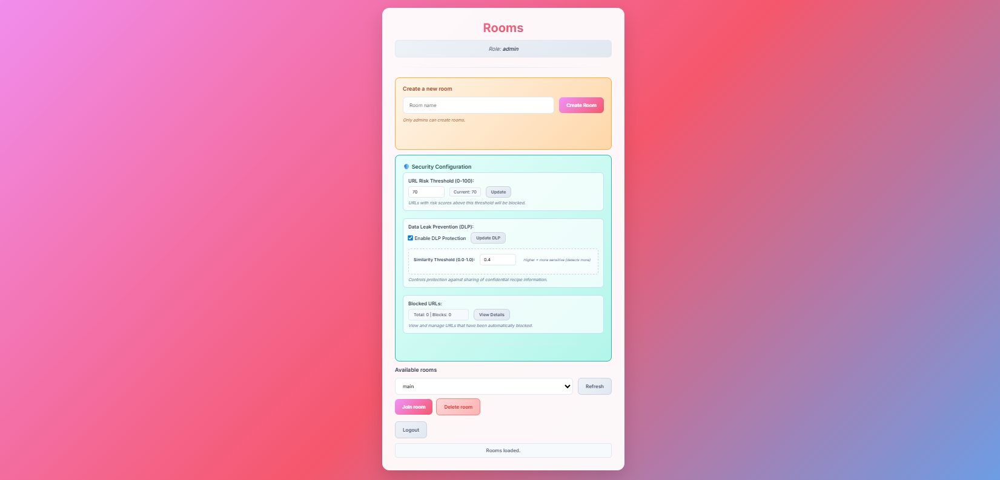
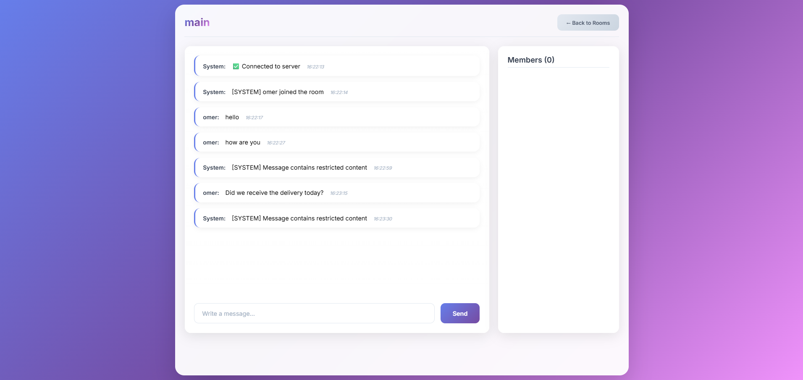

# Secure Chat
### Semantic DLP for Real-Time Messaging

Real-time messaging systems make it easy for users to accidentally expose sensitive information or share risky links.

Traditional Data Loss Prevention (DLP) approaches often rely on keyword matching, which fails to detect semantically similar content.  
At the same time, sending every message to a large language model for analysis introduces latency, cost, and operational complexity.

This project explores a different approach: building a **real-time security pipeline** that detects potential data leakage using **vector embeddings and semantic similarity**.

Sensitive knowledge in the system is first transformed into embeddings. Incoming messages are then analyzed through a layered security pipeline before they are delivered to other users.

Because the embeddings of protected data are precomputed, the runtime detection step becomes extremely fast, making the approach suitable for real-time messaging systems.

To demonstrate the concept, the current implementation models a **restaurant team chat**, where **secret recipes represent sensitive knowledge that should not leak through the messaging system**.

# Message Security Pipeline

Before a message is delivered to other users, it passes through a backend security pipeline designed to detect potential risks.

The pipeline applies several checks in sequence:

### 1. URL Analysis
Extracts URLs from the message and evaluates risk using heuristics and external threat intelligence sources.

### 2. DLP Prefilter
A lightweight classifier that categorizes messages into:

- allow
- block
- check

This stage avoids running semantic similarity on clearly safe messages.

### 3. Semantic DLP Check
Messages requiring deeper inspection are compared against embeddings of protected knowledge using cosine similarity.

### 4. Security Decision
If a rule is triggered:

- message is blocked
- a system notification is emitted
- the event is logged

For malicious URLs the system may cache the URL in the database to avoid repeated external checks.

---

# Core Idea: Semantic DLP with Embeddings

Instead of sending every message to a large language model, the system uses vector similarity.

---

embedding(message) ⋅ embedding(secret_knowledge)
│
▼
cosine similarity
│
▼
similarity > threshold → potential leak

---

Because the embeddings of protected knowledge are precomputed, runtime detection becomes extremely fast.

This enables the system to detect **semantic leakage**, not only exact keyword matches.

---

# Design Decisions

### Avoiding LLM Calls
Using embeddings allows fast semantic detection without the latency and cost of LLM calls.

### Precomputing Sensitive Knowledge
Embeddings of protected knowledge are generated once and reused.

### Multi-Stage Pipeline
The system uses layered checks:

1. URL analysis  
2. lightweight prefilter  
3. semantic similarity

Only a small portion of messages reach the expensive stage.

### Demo Domain
The system currently models a **restaurant team chat** where secret recipes represent sensitive knowledge.

The mechanism itself is domain-agnostic.

---

# Repository Structure

Key backend modules:

backend/sockets/chatSocket.js

Implements the message security pipeline and final allow/block decision.

backend/utils/dlpAutomation.js

Prefilter logic (allow / block / check).

backend/utils/dlpChecker.js

Semantic similarity detection using embeddings.

backend/utils/create_recipe_embeddings.js

Generates embeddings for protected knowledge.

---

# Example Attack Scenarios

### Direct Leakage

Sensitive knowledge:

Grandma's tomato base recipe

User message:

Send me the tomato base recipe

Result:

❌ Message blocked

---

### Semantic Leakage

Sensitive knowledge:

House tomato sauce preparation

User message:

Send me the instructions for making the tomato base sauce

Result:

❌ Message blocked

---

### Safe Message

Did we receive the delivery today?

Result:

✅ Message delivered

---

# Interface

### Login

### Admin Security Configuration

### Chat with Security Enforcement

---

# Running the Project

## Prerequisites

Install:

- Docker
- Docker Compose

Verify:

docker --version
docker compose version

---

## Environment Variables

cp backend/.env.example backend/.env
## Environment Variables

Create a local environment file:

cp backend/.env.example backend/.env
Edit the values if needed.

Example configuration:

PORT=3000
NODE_ENV=development

MONGO_URI=mongodb://mongo:27017/secured_chat

JWT_SECRET=dev-secret

URL_RISK_THRESHOLD=70
DLP_ENABLED=true

GEMINI_API_KEY=
VT_API_KEY=

API keys are optional depending on which features you enable.

---

## Start the System

From the project root:

docker compose up --build

Services:

Frontend  
http://localhost:8080

Backend  
http://localhost:3000

MongoDB  
internal container

---

## Stop

docker compose down

---

# Limitations

While the approach enables fast semantic DLP detection, it has several limitations:

• False positives due to semantic similarity  
• Threshold tuning required  
• No conversation-level context analysis  
• Possible adversarial phrasing to bypass similarity detection

These limitations represent opportunities for future improvements.

---

# Notes on AI Usage

The main focus of this project is the backend security pipeline and the semantic DLP mechanism.

To keep the focus on backend experimentation, the chat interface was intentionally kept minimal.  
Some parts of the UI were generated using AI coding tools to quickly create a simple interface for interacting with the backend.

All core backend security logic — including the pipeline orchestration, semantic similarity checks, and embedding-based detection — was implemented manually.
